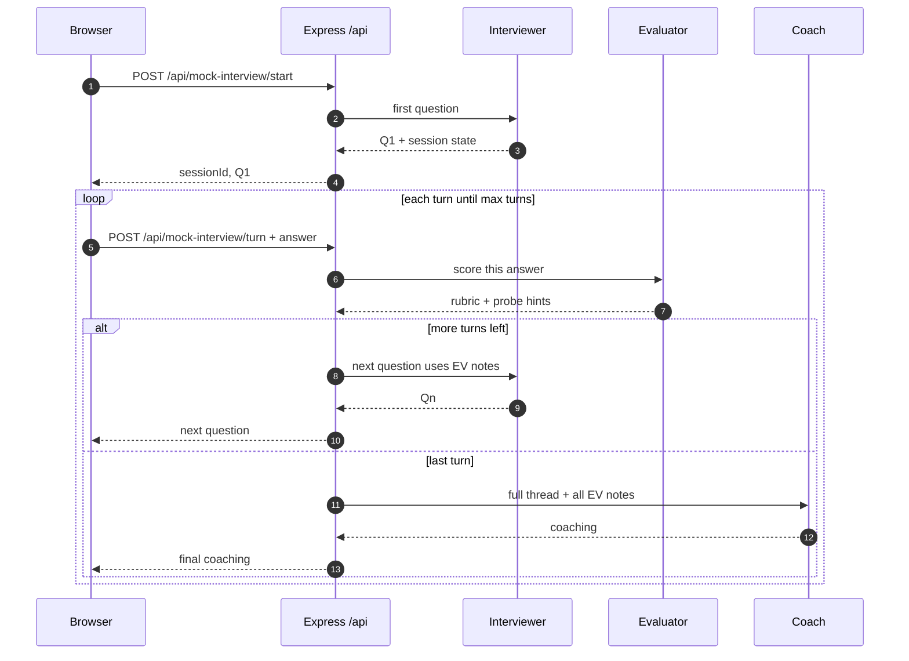

# AI Mock Interview Coach

I built this for an AI engineering internship take-home: a mock interview that actually reacts to what you say instead of reading off a fixed list of questions.

It’s a 5–7 turn flow in the browser. On the backend I split the work into three roles—interviewer, evaluator, coach—each with its own prompt in `prompts/`. Frontend is **React + Vite**, backend is **Express + TypeScript**. I kept prompts as markdown files so it’s easy to open them and see exactly what each agent is told to do.

## Demo

https://www.loom.com/share/f8cb92a3e4934638aaab11fff6a7748f

## How it works

You choose a role, a focus (`behavioral`, `technical`, `case`, or `mixed`), and how many turns you want. You can paste a short background if you want questions tied to something real.

Every turn: you type an answer → the **evaluator** scores it and writes short notes (what landed, what didn’t) → the **interviewer** uses that to ask the next question. Vague answers tend to get follow-ups that push for specifics; stronger answers can go deeper.

After the last turn, the **coach** looks at the full transcript plus those per-turn notes and gives feedback: what was strong, what to fix, and a few things I’d actually practice before the next mock.

Rough sketch of how one session moves through the server:



There’s a separate **question generator** page too—same `/api` base—when I just want a batch of practice questions without running a full session.

## Where the logic lives

Orchestration is in `server/mock-interview-agents.ts`.

| Agent | Prompt file | What it does |
|--------|----------------|---------------|
| Interviewer | `prompts/interviewer_agent.md` | Returns JSON with the next question, using prior answers + evaluator hints. |
| Evaluator | `prompts/evaluator_agent.md` | Rubric-style JSON: scores, verdict, strengths/gaps, what to probe next. |
| Coach | `prompts/coach_agent.md` | End-of-session JSON plus text the UI can show as a summary. |

I wrote the prompts to handle messy real answers—rambling STAR stories, “I don’t know,” half-right technical stuff—so the flow doesn’t assume everyone sounds polished.

## API

- `POST /api/mock-interview/start` — `targetRole`, optional `background`, `focusArea`, `turns` → `sessionId` + first question.
- `POST /api/mock-interview/turn` — `sessionId`, `answer` → evaluate, then either the next question or the final coach output on the last turn.

I used JSON-shaped outputs on purpose so when something breaks, it’s obvious in the server logs instead of silently turning into word salad.

## Things I’d change if this were “real”

Sessions live **in memory**—good enough for the assignment and quick to reason about, not something I’d ship as a product.

For models: the server tries **Gemini** first (I added optional key rotation / model fallback when one key or model errors). If you set **OpenRouter**, it can fall back there. If nothing is configured, there’s a tiny **deterministic fallback** so the app still runs end-to-end for demos; answers obviously won’t look like real LLM output in that mode.

## What I actually tuned for

The part I cared about wasn’t “more questions”—it was **whether the next question still made sense after your last answer.** The evaluator writes a small verdict each turn; the interviewer prompt is written so it has to use that, not ignore it.

Three shapes I had in mind while editing the prompts:

- **You give real detail** (numbers, constraints, what you shipped): follow-ups tend to stay on that thread—tradeoffs, edge cases, what you’d watch after deploy—instead of resetting to “so… tell me about yourself.”
- **You hand-wave** (e.g. a behavioral answer that’s basically “we improved things”): the next turn should feel like a human pushing back—what changed, which metric, how you trusted the data—not a brand-new topic pulled from a hat.
- **You start weak then recover** (thin first take, then you bring in a framework or stakeholders): later turns should reflect that—you’re not permanently stuck in “beginner mode” because of turn one.

Below are **three full 5-turn examples** I wrote to match those shapes. A live model won’t copy this wording exactly, but the *arcs* (deeper probes vs pushback vs recovery) are what I had in mind. If you only do one thing in the app, try a vague answer once and compare it to the “weak behavioral” arc.

## Example transcripts

### 1 — Strong candidate · frontend intern · technical

**Setup:** Frontend Engineer Intern, technical focus, background mentions React + TypeScript dashboards from a past internship.

**Turn 1**  
**Q:** Tell me about a performance issue you fixed on a React dashboard.  
**A:** Our analytics screen was taking 5–6 seconds to render. I used the React Profiler, found repeated renders in three widget components, memoized expensive selectors, and lazy-loaded non-critical requests. Initial render dropped to about 1.8 seconds.

**Turn 2**  
**Q:** How did you make sure memoization didn’t introduce stale data?  
**A:** I didn’t memo everything blindly—stable dependency arrays on hooks, and derived state went through centralized selectors. I wrote tests that changed query filters to confirm values actually refreshed.

**Turn 3**  
**Q:** How would you handle optimistic updates on a settings panel with lots of edits?  
**A:** Update the UI immediately, keep a rollback snapshot, reconcile when the server responds using a request id. If there’s a conflict, show a small non-blocking alert and restore from the snapshot.

**Turn 4**  
**Q:** What would you monitor after you shipped?  
**A:** Time to interactive, script evaluation time, API p95 latency, error rate, and whether people actually finished common dashboard tasks.

**Turn 5**  
**Q:** What tradeoff did you accept with this optimization?  
**A:** More complexity in the selector layer, but we documented the pattern and added tests so it didn’t become “magic memo soup.”

*Why I like this arc:* the answers give numbers and causality, so the interviewer can stay in “go deeper” mode instead of re-teaching basics.

---

### 2 — Weak candidate · data analyst intern · behavioral

**Setup:** Data Analyst Intern, behavioral focus, final-year student with one short internship.

**Turn 1**  
**Q:** Tell me about a time you influenced a decision with data.  
**A:** I made a report and the team used it to improve things.

**Turn 2**  
**Q:** What decision changed, exactly, because of your report?  
**A:** They changed strategy a bit. I don’t remember the exact details anymore.

**Turn 3**  
**Q:** Which metric did you use, and why was it a reliable choice?  
**A:** I looked at engagement. It seemed like a useful metric.

**Turn 4**  
**Q:** How did you validate data quality before you presented the results?  
**A:** I checked quickly, but I didn’t do anything super specific.

**Turn 5**  
**Q:** If you had to answer this question again in a real interview, how would you structure it?  
**A:** Probably explain more steps and the actual result.

*Why I like this arc:* the model should push on specificity and evidence, and the coach pass should lean on STAR + metric choice—not generic “just be confident” advice.

---

### 3 — Course-correcting candidate · PM intern · mixed

**Setup:** Product Manager Intern, mixed focus, background is product club + one startup internship.

**Turn 1**  
**Q:** Sales wants Feature A this sprint; engineering wants to pay down reliability debt. How do you prioritize?  
**A:** I’d ship Feature A first because revenue matters more.

**Turn 2**  
**Q:** Walk me through a framework that balances impact, effort, and risk—not just revenue.  
**A:** I’d use something like RICE: estimate reach and impact for Feature A, confidence based on data quality, and effort from engineering. I’d treat reliability risk as a penalty factor, not an afterthought.

**Turn 3**  
**Q:** How would you communicate the decision to both stakeholders?  
**A:** I’d share the scoring table and assumptions, plus a two-sprint plan: a smaller commercial milestone now while still protecting time for reliability so we don’t keep firefighting.

**Turn 4**  
**Q:** What if sales says the customer will churn unless Feature A ships in full right now?  
**A:** I’d validate urgency with account data, define a scoped MVP for Feature A, and set explicit success and rollback criteria so we’re not betting the company on vibes.

**Turn 5**  
**Q:** What’s one risk in your approach?  
**A:** RICE can hide qualitative risk, so I’d add a short risk review with eng and support before locking the plan.

*Why I like this arc:* the first answer is shallow on purpose; after a hard probe the candidate levels up, and later questions should reward that instead of treating them like they never improved.

## Repo layout

```text
convolyzer-AI-Mock-Interview-Coach/
├── prompts/
│   ├── interviewer_agent.md
│   ├── evaluator_agent.md
│   └── coach_agent.md
├── server/
│   ├── index.ts
│   ├── mock-interview-agents.ts
│   ├── question-generator.ts
│   └── interview-analyzer.ts
├── src/
├── requirements.txt
└── README.md
```

## Run it

Node 18+ and npm.

```bash
git clone https://github.com/JiyaSingh18/convolyzer-AI-Mock-Interview-Coach.git
cd convolyzer-AI-Mock-Interview-Coach
npm install
```

`server/.env` (there’s an example in `server/.env.example`):

```env
GEMINI_API_KEY=your_key_here
GEMINI_API_KEYS=optional_comma_separated_backup_keys
OPENROUTER_API_KEY=optional
OPENROUTER_API_KEYS=optional_comma_separated_backup_keys
```

Terminal 1: `npm run server:dev`  
Terminal 2: `npm run dev`  
App: **http://localhost:5173**

